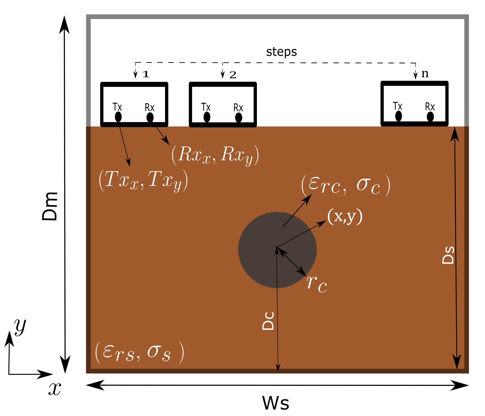

# 2D electromagnetic simulator
2D Electromagnetic Simulator for GPR Scenarios. This simulator allows for varying the relative permittivity and conductivity of the subsurface. Additionally, cylindrical objects can be added, defined by a coordinate (x, y) indicating the center of the cylinder, as well as their relative permittivity and conductivity. The simulation requires defining the location of the transmission and reception antennas, as well as the frequency of the Ricker pulse. The spatial description value used in the simulation is 0.01cm. Below is an example image showing all the parameters necessary to configure the GPR scenario.



## Table of Contents

- [Installation](#installation)
- [Code Example](#code-example)
- [Create the environment](#Create-the-environment)

  
## Installation

Instructions on how to install the project. For example:
```bash
git clone https://github.com/usuario/nombre-del-proyecto.git
cd nombre-del-proyecto
pip install -r requirements.txt
```

## Code Example
For instance, the following code can be executed in Google Colab. Simply copy and paste it into a new Colab notebook.
```bash

import create_gpr_image as create_gpr
import visualization as vis

#--------------------------------------------------------------------------------
# 1) definition of parameters for the simulation
dicc_model ={
      'name_simulation':'test_1.npy',
      'model_size_x' : 100 ,
      'model_size_y': 60,
      'TX_antenna_position_x':10,
      'TX_antenna_position_y':50,
      'RX_antenna_position_x':14,
      'RX_antenna_position_y':50,
}

dicc_simulation = {
      'steps_antenna': 60,
      'time_window': 420,
      'frecuency': 1.6e9,

}


characteristics_subsurface= { 
'permittivity_r': 5,
'conductivity': 0.005, #mS/m
'subsurface_height': 50
}

characteristics_cylinder= { 'x_position': 50,
'y_position': 35,
'conductivity': 5.81e7, #cu
'permittivity_r': 1,
'radius': 3
}

#--------------------------------------------------------------------------------
# 2) Perform simulation:
ez = create_gpr.run_image(dicc_model,dicc_simulation,characteristics_subsurface,characteristics_cylinder )
#--------------------------------------------------------------------------------
# 3) show result:
vis.graph_ez(ez) 

```
## Create the environment
Create a local environment using Anaconda from an environment.yml file.

```bash
conda env create -f environment.yml
```

